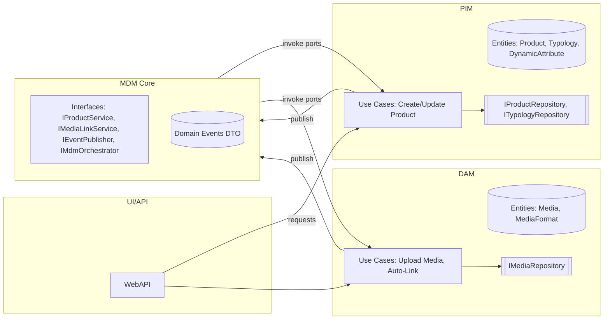

# Examen Final Clean Architecture

## Partie 1 — Questions de compréhension

### Q1. Rôle de l’architecte
**Au‑delà du code**, l’architecte : (1) **cadre l’alignement** entre besoins métier et capacités techniques, 
(2) **crée des contraintes bénéfiques** (frontières, règles de dépendance), 
(3) **assure l’évolutivité** (qualité, dette, sécurité).  
**Deux décisions à fort impact long terme :**
1. **Frontières et dépendances** (Clean Architecture) : cas d’usage indépendants du Web/ORM → facilite la **testabilité** et la **migration** (ex. changement de base sans réécrire l’application).
2. **Stratégie de modularisation** (principe ADP + SAP/SDP) : découper PIM et DAM en modules autonomes, **publiant des interfaces** et **événements**, réduit le **couplage** et les **cycles** → maintenance et déploiement indépendants.

### Q2. Principes SOLID

1. **S — Single Responsibility Principle (SRP)**  
   - *Définition* : une classe/module a **une seule raison de changer**.  
   - *Anti‑exemple* :  
     ```pseudo
     class ProductService:
       saveToDb(p)
       renderHtml(p)
     ```
   - *Refactor* : séparer `ProductRepository` (persistance) et `ProductPresenter` (formatage).

2. **O — Open/Closed Principle (OCP)**  
   - *Définition* : ouvert à l’extension, **fermé à la modification**.  
   - *Anti‑exemple* : `switch(format)` dans `MediaProcessor` pour JPG/PNG/PDF…  
   - *Refactor* : `IMediaHandler` + enregistrement de nouveaux handlers par **plug‑in**.

3. **L — Liskov Substitution Principle (LSP)**  
   - *Définition* : les sous‑types doivent pouvoir **remplacer** leurs super‑types sans briser l’**invariance** (contrats).  
   - *Anti‑exemple* : `ReadOnlyRepository` héritant de `Repository` mais **throw** sur `Add`.  
   - *Refactor* : extraire interfaces spécifiques (`IReadRepository`, `IWriteRepository`).

4. **I — Interface Segregation Principle (ISP)**  
   - *Définition* : préférer **plusieurs petites interfaces** à une grosse interface versatile.  
   - *Anti‑exemple* : `IProductGateway` avec `Add`, `Delete`, `Search`, `ExportToPdf`, `Notify`.  
   - *Refactor* : `IProductRepository`, `IProductSearch`, `IProductNotifier`…

5. **D — Dependency Inversion Principle (DIP)**  
   - *Définition* : le **haut niveau** dépend d’**abstractions**, jamais de détails.  
   - *Anti‑exemple* : un Use Case qui instancie `SqlProductRepository`.  
   - *Refactor* : `ICreateProduct` dépend de `IProductRepository` (interface). L’implémentation est injectée à l’exécution.

### Q3. Principes de composants

- **Cohésion**  
  - **REP** (*Reuse/Release Equivalence*) → un **module** réutilisable doit **versionner** ses releases. *Ex.* : `Mdm.Core` publié avec versioning sémantique.  
  - **CCP** (*Common Closure*) → classes qui **changent ensemble** restent ensemble. *Ex.* : `Pim.Domain` contient `Product`, `Typology`, `DynamicAttribute` car les changements de règles produits les affectent ensemble.  
  - **CRP** (*Common Reuse*) → ne pas forcer à prendre ce qu’on n’utilise pas. *Ex.* : séparer `Dam.Domain` de `Pim.Domain`.

- **Couplage**  
  - **ADP** (*Acyclic Dependencies*) → **éviter les cycles**. *Ex.* : PIM ↔ DAM communiquent via **événements** et **interfaces** du `Mdm.Core`.  
  - **SDP** (*Stable Dependencies*) → dépendre de modules **plus stables**. *Ex.* : Applications dépendent de `Mdm.Core` (contrats stables).  
  - **SAP** (*Stable Abstractions*) → les modules stables doivent être **abstraits**. *Ex.* : `Mdm.Core` n’a que des interfaces/DTO/événements.

### Q4. Règle des dépendances
Les dépendances **pointent vers l’intérieur** : UI/Infra → Interfaces → Use Cases → Entités.  
« **Les détails dépendent des abstractions** » : les frameworks (Web, DB, Cloud) **implémentent** des **ports** définis au centre. On peut changer un détail (ex. ORM) **sans** modifier les Use Cases/Domain.

### Q5. Tests et Clean Architecture
- **Entités** : tests **purs** (domain rules).  
- **Use Cases** : tests **avec doubles** (`InMemory`/mocks) sur ports (`IRepository`, `IEventPublisher`).  
- **Adaptateurs** : tests d’**intégration** ciblés (mapping, sérialisation, contrôleurs).  
- **Frameworks** : **contract tests** sur implémentations (ex. repo SQL respecte `IProductRepository`).  
Limiter la **fragilité** : isoler logique métier, utiliser **builders**/**fixtures**, tester par **comportements** (Given‑When‑Then), stabiliser les ports.

---

## Partie 2 — Étude de cas & conception

### C1. Modélisation (10 pts)



Flux **upload média → association** : `UploadMediaBatch` (DAM) → **parse** EAN/SKU → **publie** `MediaUploaded` → `Mdm.Core` **orchestrates** → appelle `IMediaLinkService` (DAM) + `IProductService` (PIM) pour créer `LienProduitMedia`.

**Entités clés** : `Product`, `Typology`, `DynamicAttribute` (PIM) ; `Media`, `MediaFormat`, `MediaLink` (DAM).

### C2. Justification des choix
- **DIP/OCP** : nouveaux formats média = nouveaux **handlers** implémentant `IMediaHandler` **sans** modifier `UploadMediaBatch`; nouvelles typologies = nouvelles **FormDefinitions** data‑driven.  
- **ADP** : PIM et DAM **ne se réfèrent pas** directement l’un à l’autre ; ils dépendent de **`Mdm.Core`** (ports/événements).  
- **Tests avec mocks** : Use cases testés contre `IProductRepository`, `ITypologyRepository`, `IMediaRepository`, `IEventPublisher` (faux).

### C3. Découpage en composants
- **Modules** : `Pim.*`, `Dam.*`, `Mdm.Core`, `Mdm.Api`.  
- **Cohésion (REP/CCP/CRP)** : chaque module regroupe classes qui changent ensemble ; domaines séparés évitent l’**utilisation parasite**.  
- **Couplage (ADP/SDP/SAP)** : dépendances dirigées vers `Mdm.Core` (abstrait, stable). Pas de cycle.

---

## Partie 3 — Réalisation pratique (.NET 8)

### Modélisation — Cas d’usage
- **PIM**  
  1. `CreateProduct` selon typologie (+ validation `FormDefinition`).  
  2. `UpdateProductAttributes` (attributs dynamiques conformes à la typologie).
- **DAM**  
  1. `UploadMediaBatch` (liste de fichiers) → création `Media`.  
  2. `AutoLinkMediaByCodes` (parse EAN/SKU depuis nom de fichier) → création `MediaLink`.

Les implémentations sont fournies dans les projets `*.Application` avec ports en interfaces.

### Sécurité (JWT + RBAC minimal)
L’API expose endpoints protégés via **Bearer JWT** (`admin`/`user`). Secret **de démonstration** dans `appsettings.Development.json` ; en production, stocker dans un **Key Vault**.

### Tests
Exemple de test unitaire xUnit pour `CreateProduct` (PIM) avec repos mémoire.

### Déploiement (bonus)
Proposition : microservices PIM, DAM, Core, API **dockerisés**, orchestrés via `docker-compose` (ou K8s), CI GitHub Actions : build, tests, scan SCA, push images → déploiement. Voir `README` et commentaires dans le code.

---

## Démarrage rapide

```bash
# Dossier / solution
CleanMDM.sln
src/
  Mdm.Api/         # Web API minimale
  Mdm.Core/        # Ports, Events, Orchestrator abstrait
  Pim.*            # Domaine + Use cases + Infra mémoire
  Dam.*            # Domaine + Use cases + Infra mémoire
tests/
  UnitTests/       # xUnit

# Restaurer & compiler (exécuté sur votre machine)
dotnet restore
dotnet build
dotnet test
dotnet run --project src/Mdm.Api
```

Endpoints (extraits) :
- `POST /api/pim/products` (role: admin) — crée un produit selon une typologie.  
- `POST /api/dam/media/upload` — upload simulé (métadonnées) + auto‑link.
- `Lien du projet:` http://localhost:49370/swagger/index.html

---
